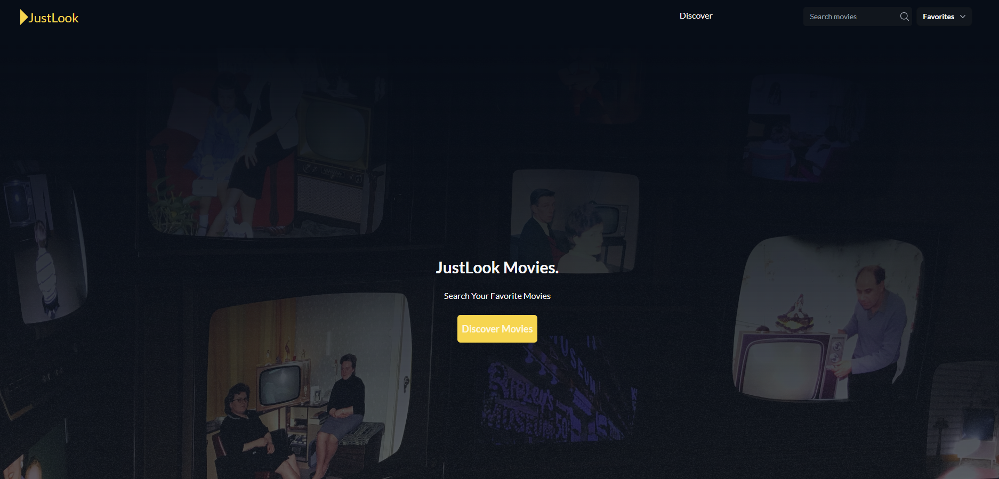

# JustLook - Movie App

JustLook is a movie app that allows users to discover and explore movies from TMDB. It provides features for searching, viewing movie details, and managing favorite movies using local storage. Movies can be sorted by genre and popularity.



## Features

- Search for movies by title.
- View information about a movie, including title, release date, tagline, genres, rating, revenue, and synopsis.
- Add and remove movies from your list of favorites. Your favorites are stored locally.
- Sort movies by genre or popularity.
- Discover a wide range of movies from TMDB's extensive database.

## Usage

- Enter a movie title in the search bar to search for movies by name.
- Click on a movie card to view detailed information about that movie.
- Click the heart icon to add or remove a movie from your favorites list.
- Use the genre and popularity filters to sort and discover movies.

## Technologies Used

- React.js: A JavaScript library for building user interfaces.
- TMDB API: The Movie Database API for fetching movie data.
- Local Storage: Used for storing favorite movies on the user's device.
- Tailwind CSS: A utility-first CSS framework for styling.

## Building a Docker Image

You can also run the JustLook app in a Docker container. To do this, follow these steps:
Make sure you have Docker installed on your machine.
Clone the repository to your local machine if you haven't already.

- Navigate to the project directory:

  ```
      cd JustLook
  ```

- Build the Docker image using the provided Dockerfile:

  ```
      docker build --build-arg ARG_REACT_APP_MOVIEDB_API_KEY={your_api_key} -t justlook-app .
  ```

## Deployed Site

You could also visit the deployed site at https://justlook.netlify.app/

## Acknowledgments

Thanks to TMDB for providing the movie data.
Special thanks to the creators and contributors of the libraries and frameworks used in this project.
